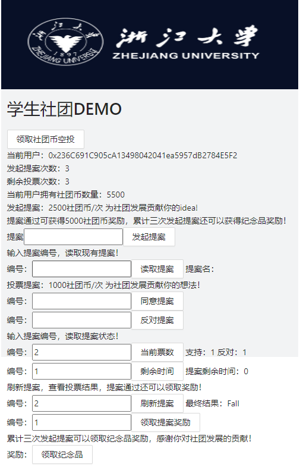

# ZJU-blockchain-course-2022

⬆ 可以️修改成你自己的项目名。

> 第二次作业要求（可以删除）：
> 
> 去中心化学生社团组织治理应用 
> 
> - 每个学生初始可以拥有或领取一些通证积分（ERC20）。 
> - 每个学生可以在应用中可以： 
>    1. 使用一定数量通证积分，发起关于该社团进行活动或制定规则的提案（Proposal）。 
>    2. 提案发起后一定支出时间内，使用一定数量通证积分可以对提案进行投票（赞成或反对，限制投票次数），投票行为被记录到区块链上。 
>    3. 提案投票时间截止后，赞成数大于反对数的提案通过，提案发起者作为贡献者可以领取一定的积分奖励。 
> 
> - (Bonus）发起提案并通过3次的学生，可以领取社团颁发的纪念品（ERC721）

**以下内容为作业仓库的README.md中需要描述的内容。请根据自己的需要进行修改并提交。**

作业提交方式为：提交视频文件和仓库的连接到指定邮箱。

## 如何运行

1. 在本地启动ganache应用。

2. 在 `./contracts` 中安装需要的依赖，运行如下的命令：
    ```bash
    npm install
    ```
3. 在 `./contracts` 中编译合约，运行如下的命令：
    ```bash
    npx hardhat compile
    ```
4. 在 `./contracts` 中部署合约，运行如下的命令：
    ```bash
    npx hardhat run scripts/deploy.ts --network ganache
    ```
5. 在 `./frontend` 中启动前端程序，运行如下的命令：
    ```bash
    npm run start
    ```
6. 自动跳转或在Chrome中输入http://localhost:3000/，打开DAPP界面

## 功能实现分析

简单描述：项目完成了要求的哪些功能？每个功能具体是如何实现的？

建议分点列出。

1、每个学生初始可以拥有或领取一些通证积分（ERC20）
初始可以点击“领取社团币空投”，领取10000社团币
限制：不可重复领取
实现：在前端调用MyERC20中的函数airdrop
注：一开始总想先在ClubDAO里创建一个函数调用airdrop，msg.sender就成了ClubDAO地址。

2、每个学生可以使用一定数量通证积分，发起关于该社团进行活动或制定规则的提案（Proposal）。
2.1发起提案内容：输入提案内容，点击“发起提案”，扣除2500社团币发起提案
2.2查询已发起的提案内容：输入提案编号，点击“读取提案”
2.3（自动更新）当前同学已发起提案的次数
实现：
2.1在前端调用ClubDAO中的addProposal函数，并通过ERC20自带的approve函数扣除2500社团币，发起提案
2.2在前端调用ClubDAO中的getProposalName函数即可读取提案
2.3在前端调用ClubDAO中的getAddProposalTimes函数（写在useEffect自动更新）
提案相关信息存储在Proposal（某个提案的具体信息）和Proposals(共同信息，mapping根据编号索引提案)结构体中

3、提案发起后一定时间内，使用一定数量通证积分可以对提案进行投票（赞成或反对，限制投票次数），投票行为被记录到区块链上。 
3.1投票提案：输入提案编号，点击“同意提案/反对提案”
3.2查看当前票数：输入提案编号，点击“当前票数”，可以查询到当前支持票和反对票分别的票数
3.3（自动更新）当前同学已参与投票的次数
3.4记录投票行为
限制：每人最多投票5次
实现：
3.1在前端调用ClubDAO中的voteProposal函数，并通过ERC20自带的approve函数扣除1000社团币，对提案进行投票
3.2在前端调用ClubDAO中的getProposalAgree/getProposalDisagree函数,分别读取支持与反对票数
3.3在前端调用ClubDAO中的getVoteProposalTimes函数（写在useEffect自动更新）
3.4采用事件event记录投票行为，包含支持/反对，提案编号，投票时间，投票地址
投票相关信息存储在Result（某个提案的投票结果）和Results(共同信息，mapping根据编号索引投票结果)结构体中

4、提案投票时间截止后，赞成数大于反对数的提案通过，提案发起者作为贡献者可以领取一定的积分奖励。
4.1显示提案剩余投票时间：点击“剩余时间”
4.2显示提案结果：点击“刷新提案”，“最终结果：”显示Pass/Fall
限制：只有提案已截止后才能查看提案最终结果
4.3提案发起者领取5000社团币奖励：输入提案编号，点击“领取提案奖励”
限制：只有发起者才能领取这笔奖励
实现：
4.1在前端调用ClubDAO中的getEndTime函数获取提案结束时间，并读取当前时间Date.parse(new Date().toString())/1000，二者相减剩余时间
（如果当前时间>结束时间，说明提案已结束，剩余时间为零）
4.2在前端调用ClubDAO中的updateProposalResult函数,比较同意票数与反对票数
（只有同意票数 > 反对票数才会通过，若二者相等也是Fall）
4.3在前端调用ClubDAO中的getProposalReward函数，判断条件包括：领取者是提案发起者，提案已结束且结果已显示，提案结果为Pass等
若满足条件，则在前端调用MyERC20中的reward函数

5、(Bonus）发起提案3次的学生，可以领取社团颁发的纪念品（ERC721）
用户可以在前端看到自己已发起提案的次数（2.3），若发起提案超过3次，点击“领取纪念品”可以领取奖励。
（注：由于“发起提案的次数”和“发起提案并通过的次数”的判定，技术上实现起来难度相似，此处稍作简化）
实现：在前端在前端调用ClubDAO中的getBonus函数


## 项目运行截图

放一些项目运行截图。

项目运行成功的关键页面和流程截图。主要包括操作流程以及和区块链交互的截图。

0 整体界面


1 领取空投
领取前：

领取后：


2.1 发起提案
前：

后：

2.2 读取提案

2.3 显示发起提案次数
自动更新，见2.1

3.1 投票
前：

后：

重复投票无效：

3.2 当前票数


4.1 剩余时间

4.2 查看结果
成功：

投票未截止：

4.3 领取奖励
前：

后：

未通过的提案无法领奖：


5 领取Bonus


## 参考内容

课程的参考Demo见：[DEMOs](https://github.com/LBruyne/blockchain-course-demos)。
如果有其它参考的内容，也请在这里陈列。
https://github.com/LBruyne/blockchain-course-demos-master
